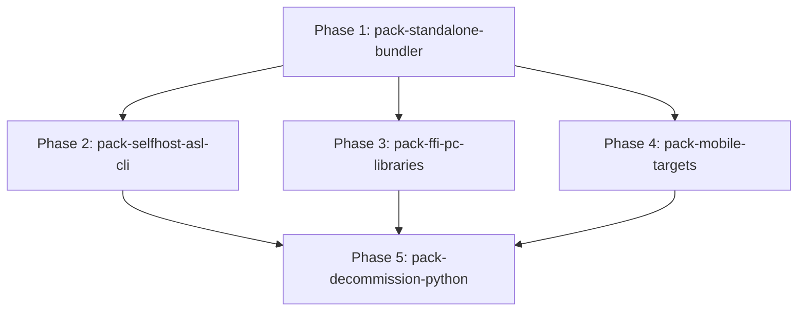

# ASL-Pack Execution Phases & Roadmap (Steps Protocol)

**Orchestrator**: Antigravity (`steps`)  
**Separation of Duties**: Implementer writes code; reviewer evaluates in clean context; orchestrator commits.  
**Execution Strategy**: Sequential DAG waves with strict pre-commit verification gates.

---

## 1. Phase Dependency Graph (DAG)

---

## 2. Phase Matrix

| Phase ID | Description | Priority | Depends On | Owns | Gate Command | Status |
|---|---|---|---|---|---|---|
| `pack-standalone-bundler` | Self-contained executable bundler (Mach-O, ELF, PE) with runtime matrix integration | `P0` | `[]` | `pack/src/standalone.asl`, `pack/templates/`, `pack/tests/standalone_test.asl` | `node --test pack/tests/standalone.test.js` | `pending` |
| `pack-selfhost-asl-cli` | Compile `asl-cli` and `asl-gates` into native standalone `asl` binary; replace `asl/agentscript` | `P0` | `[pack-standalone-bundler]` | `asl/agentscript`, `asl/packages/asl-cli/`, `asl/packages/asl-gates/` | `./asl/agentscript check pack/src/pack.asl` | `pending` |
| `pack-ffi-pc-libraries` | Native FFI library linker, dynamic library resolver (.dylib/.so/.dll), and pkg-config integration | `P1` | `[pack-standalone-bundler]` | `pack/src/ffi_linker.asl`, `pack/tests/ffi_test.asl` | `node --test pack/tests/ffi.test.js` | `pending` |
| `pack-mobile-targets` | Swift Package (AOT) and Kotlin/JNI target generators for iOS and Android | `P1` | `[pack-standalone-bundler]` | `pack/src/targets/swift.asl`, `pack/src/targets/kotlin.asl`, `pack/tests/mobile_test.asl` | `node --test pack/tests/mobile.test.js` | `pending` |
| `pack-decommission-python` | Complete deletion of `asl/.venv`, `gate.py`, and Python bootstrap files; full self-hosted gate | `P0` | `[pack-selfhost-asl-cli, pack-ffi-pc-libraries, pack-mobile-targets]` | `asl/.venv/`, `asl/checker/gate.py`, `tools/sync_workspace.py` | `python3 tools/sync_workspace.py --check` | `pending` |

---

## 3. Wave Execution Schedule

- **Wave 0 (Core Bundler Substrate)**:
  - `pack-standalone-bundler`
- **Wave 1 (CLI Self-Hosting & Target Adapters)**:
  - `pack-selfhost-asl-cli` (Track A: Core Self-Hosting)
  - `pack-ffi-pc-libraries` (Track B: Native C/PC-Linker)
  - `pack-mobile-targets` (Track C: Mobile Swift & Kotlin)
- **Wave 2 (Final Python Cleanout & End-to-End Audit)**:
  - `pack-decommission-python`
